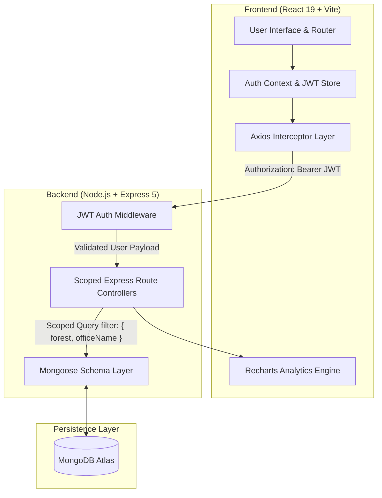

# 🌲 Viyal – AI-Powered Forest Monitoring System

<div align="center">

**An End-to-End Smart Forest Intelligence, Ecosystem Protection, and Threat Monitoring Platform**


[](LICENSE)

---

### 🎥 [Watch Demo Video](https://drive.google.com/file/d/1N6WzhrhTLRS_KwrxfmTmDz-hpH0fLgnX/view?usp=sharing) &nbsp;|&nbsp; 📄 [Read Project Report (PDF)](https://drive.google.com/file/d/1DoLxAqraomdJfspO1uz59IbQPqFJ2Gvt/view?usp=sharing) &nbsp;|&nbsp; 📁 [All Project Resources (Drive Folder)](https://drive.google.com/drive/folders/1_aLEKaQBrAMVTl3CvtpTcJTOf9aLEtZ6?usp=sharing)

[](https://drive.google.com/file/d/1N6WzhrhTLRS_KwrxfmTmDz-hpH0fLgnX/view?usp=sharing)
[](https://drive.google.com/file/d/1DoLxAqraomdJfspO1uz59IbQPqFJ2Gvt/view?usp=sharing)
[](https://drive.google.com/drive/folders/1_aLEKaQBrAMVTl3CvtpTcJTOf9aLEtZ6?usp=sharing)

</div>

---

## 📽️ Project Demonstration & Documentation Links

> 💡 **Demo Walkthrough & Assets**: Experience the live system demonstration showing dashboard KPIs, real-time threat incident escalation, geofence tracking, wildlife camera trap detection feeds, and AI environmental analytics.

| Resource | Link | Description |
| :--- | :--- | :--- |
| 🎥 **Viyal System Demo Video** | [Watch Video on Google Drive 🔗](https://drive.google.com/file/d/1N6WzhrhTLRS_KwrxfmTmDz-hpH0fLgnX/view?usp=sharing) | Complete video walkthrough of dashboard, live threat alerts, geofence logs, and AI insights. |
| 📄 **Viyal Full Project Report** | [Read Report PDF on Google Drive 🔗](https://drive.google.com/file/d/1DoLxAqraomdJfspO1uz59IbQPqFJ2Gvt/view?usp=sharing) | Comprehensive technical project documentation and engineering report. |
| 📁 **All Project Resources Folder** | [Browse Folder on Google Drive 🔗](https://drive.google.com/drive/folders/1_aLEKaQBrAMVTl3CvtpTcJTOf9aLEtZ6?usp=sharing) | Complete Google Drive directory containing demo video, project report, screenshots, and visual assets. |

---

## 📌 Table of Contents

- [Executive Overview](#-executive-overview)
- [Hardware Sensor Infrastructure (Edge Layer)](#-hardware-sensor-infrastructure-edge-layer)
- [System Architecture & Behind-the-Scenes Pipeline](#-system-architecture--behind-the-scenes-pipeline)
- [Step-by-Step User Journey & Workflow](#-step-by-step-user-journey--workflow)
- [Key Features & Capabilities](#-key-features--capabilities)
- [Technology Stack](#-technology-stack)
- [Database Schema & Data Models](#-database-schema--data-models)
- [REST API Reference](#-rest-api-reference)
- [Installation & Quick Start Guide](#-installation--quick-start-guide)
- [Project Directory Structure](#-project-directory-structure)
- [License & Support](#-license--support)

---

## 🎯 Executive Overview

Modern forest conservation faces severe challenges: rampant illegal deforestation, wildlife poaching, forest fires, human-wildlife conflict, and rapid ecological degradation. Traditional manual forest patrols are limited by vast geographic terrain, slow response times, and fragmented reporting.

**Viyal** (derived from the Tamil word representing flourishing nature) is an **AI-powered Forest Monitoring & Ecosystem Protection System**. It provides forest range officers and wildlife administrative units with a unified, real-time command dashboard. Viyal ingests automated edge detection events—such as chainsaw acoustics, gunshot frequencies, unauthorized human/vehicle intrusions, thermal anomaly detection, and automated camera trap wildlife identification—and surfaces them inside a multi-tenant division dashboard.

### Core Value Propositions
- **Real-Time Threat Prevention**: Instantaneous escalation of chainsaw, gunshot, fire, and human trespass alerts.
- **Division-Scoped Multi-Tenancy**: Data is securely segmented by Forest Division, Forest Reserve, and District.
- **Geofenced Zone Security**: Granular monitoring of Restricted Core Zones, Buffer Zones, and Safe Corridors.
- **Automated Wildlife & Endangered Species Tracking**: Computer-vision-backed species cataloging with automated dispatch notifications for endangered sightings.
- **Ecosystem Health Analytics**: Longitudinal trends for vegetation canopy coverage, water body retention, and animal migration behavior with actionable AI recommendations.

---

## 🛰️ Hardware Sensor Infrastructure (Edge Layer)

While Viyal is primarily a high-performance web software platform, it is designed to ingest data from an array of deployed field hardware sensors:

```
┌────────────────────────┐      ┌─────────────────────────┐      ┌─────────────────────────┐
│ Acoustic Sensor Nodes  │      │  Thermal & PIR IoT Nodes│      │ AI Smart Camera Traps   │
│ (Chainsaw / Gunshots)  │      │ (Infiltration / Motors) │      │  (Wildlife Detection)   │
└───────────┬────────────┘      └────────────┬────────────┘      └────────────┬────────────┘
            │                                │                                │
            └────────────────────────┬───────┴────────────────────────────────┘
                                     │  (MQTT / Cellular / Satellite Telemetry)
                                     ▼
                        ┌──────────────────────────┐
                        │   Viyal REST API Engine  │
                        └──────────────────────────┘
```

- **Acoustic Monitoring Nodes**: Solar-powered mic arrays listening for specific audio frequencies (chainsaw motors, gunshots, heavy machinery).
- **Thermal & PIR Intrusion Nodes**: Perimeter IoT sensors detecting unauthorized foot movement or vehicles across forest boundaries.
- **AI Camera Traps**: Vision nodes executing edge inferences to detect and identify wildlife species passing through corridors.
- **Environmental Telemetry Sensors**: Soil moisture meters, canopy density optical sensors, and waterbody level sensors.

---

## 🏗️ System Architecture & Behind-the-Scenes Pipeline

Viyal relies on a clean, scalable decoupling of the React client application and the Node.js/Express REST backend.



### ⚙️ Behind-the-Scenes Data Processing Pipeline

1. **Division-Scoped Authentication & Multi-Tenancy**:
   - When a forest officer logs in with their District, Forest Name, Office Name, and Password, the backend authenticates credentials via `bcryptjs` against the `User` collection.
   - Upon successful verification, an 8-hour JSON Web Token (JWT) is issued. The JWT payload encodes the officer’s `district`, `forest`, `officeName`, and `role`.
   - Every subsequent request carries the JWT in the `Authorization: Bearer <token>` header. The `authMiddleware` decodes the token and attaches `req.user` to the request pipeline.
   - **Automatic Data Scoping**: All database queries for alerts, zones, species, and insights automatically enforce the filter `{ forest: req.user.forest, officeName: req.user.officeName }`. This ensures absolute data isolation between different forest divisions (e.g., *Anamalai Tiger Reserve* cannot access *Mudumalai Tiger Reserve* logs).

2. **Threat Escalation & Status Lifecycle**:
   - Threat detections enter the system as `Active` alerts tagged with severity (`High`, `Medium`, `Low`) and exact spatial coordinates (`lat`, `lng`).
   - Officers review active threats and switch the status to `Investigating` (dispatching field ranger units) or `Resolved` (incident contained).

3. **Species Cataloging & Alert Dispatch Engine**:
   - Detection feeds process incoming species sightings. When an endangered species (e.g., Bengal Tiger, Indian Elephant) is logged, officers can trigger an automated alert patch request (`PATCH /api/species/:id/alert`), marking `alertSent: true` to notify regional conservation teams.

4. **Environmental Trend Processing**:
   - Monthly ecosystem metrics (Vegetation Index %, Sightings Count, Water Availability Score) are aggregated and analyzed. Algorithms flag declining trends and surface automated advisory recommendations.

---

## 🚶 Step-by-Step User Journey & Workflow

Here is how a Forest Range Officer interacts with Viyal in a real-world operational workflow:

```
[1. Login] ──► [2. Executive Dashboard] ──► [3. Live Threat Alert Review]
                                                      │
                                                      ▼
[6. AI Recommendations] ◄── [5. Species Feed] ◄── [4. Zone Activity Logs]
```

### Step 1: Secure Division Login
- The officer navigates to `/login`.
- Selects or inputs their **District** (e.g., *Coimbatore*), **Forest Reserve** (e.g., *Anamalai Tiger Reserve*), **Office Division** (e.g., *Pollachi Forest Division*), and Password.
- Upon authentication, the dashboard initializes their session token in `localStorage`.

### Step 2: Overviewing the Executive Dashboard
- The officer lands on `/dashboard`, displaying live metrics:
  - **Total Alerts** & **Active Threat Counter** (High/Medium/Low priority breakdown).
  - **High-Risk Zones Count** currently flagged for elevated risk.
  - **Endangered Wildlife Sightings** recorded today.
  - **Operational Module Indicators**: Live health status of Threat Detection, Geo-Fencing, Species AI, and Sensor Sync.
  - **Quick Active Alert Table**: The top 5 pending incidents requiring immediate officer attention.

### Step 3: Managing Live Threats & Incident Response
- Navigating to **Threat Detection ➔ Live Alerts** (`/threat-detection/live-alerts`):
  - The officer filters incoming incidents by **Type** (*Chainsaw*, *Gunshot*, *Human Intrusion*, *Vehicle*, *Fire*, *Landslide*), **Severity**, or **Status**.
  - Reviewing a `High` severity *Chainsaw sound detected near Eastern River Corridor*:
  - Click **Investigate**: Updates the status to `Investigating` so team members know rangers are dispatched.
  - Click **Resolve**: Marks the threat as closed once contained.
- Navigating to **Alert History** (`/threat-detection/history`) allows inspecting past resolved incidents.

### Step 4: Geo-Fencing & Zone Patrol Monitoring
- Navigating to **Geo-Fencing ➔ Zone Monitoring** (`/geo-fencing/zones`):
  - The officer reviews mapped forest sectors (*Core Protected Zone Alpha*, *Northern Buffer Zone*, *Eastern River Corridor*).
  - Inspects zone risk classifications (`Restricted`, `Buffer`, `Safe`) and surface area metrics.
- Navigating to **Activity Logs** (`/geo-fencing/logs`):
  - Views real-time chronological logs of zone activities (e.g., *Loitering vehicle parked 3+ hours near waterbody*, *Thermal sensor triggered at 02:30 AM*).

### Step 5: Wildlife Species Monitoring & Endangered Alerts
- Navigating to **Species Alerts ➔ Detection Feed** (`/species/feed`):
  - Displays visual detection cards for sighted animals, complete with scientific names, IUCN conservation status tags (`CR`, `EN`, `VU`, `NT`, `LC`), camera trap image, and GPS coordinates.
  - For endangered sightings (e.g., Bengal Tiger in Core Zone Alpha), the officer clicks **Send Alert Notification** to issue regional dispatches.
- Navigating to **Species Records** (`/species/records`) allows searching and filtering the complete wildlife registry.

### Step 6: Ecological Health Analytics & AI Advisory Insights
- Navigating to **Well-Being Insights ➔ Environmental Trends** (`/insights/trends`):
  - Interactive Recharts graphs display monthly metrics across 3 main pillars:
    1. **Vegetation Cover Index (%)**: Line chart monitoring canopy density.
    2. **Wildlife Sightings Count**: Bar chart tracking animal movements.
    3. **Water Availability Score**: Line chart showing waterbody depletion.
- Navigating to **Recommendations** (`/insights/recommendations`):
  - System-generated AI recommendations (e.g., *"Reforestation required in Sector B. Increase patrol in fire-prone zones"*, *"Create artificial water holes in core zone during dry season"*).

---

## ⚡ Key Features & Capabilities

- 🚨 **Real-Time Threat Detection**: Instant categorization of critical threats (poaching, illegal logging, fire breakouts, human intrusion).
- 🔒 **Multi-Tenant Division Scoping**: Strict boundary isolation ensuring officers view data exclusive to their jurisdiction.
- 🗺️ **Geofence Zone Security**: Categorized boundary tracking (Restricted, Buffer, Safe) with incident history.
- 🐅 **AI Wildlife Detection Feed**: Real-time species identification with IUCN red list classification tags and instant dispatch triggers.
- 📈 **Longitudinal Trend Analytics**: Recharts-powered graphs monitoring canopy, fauna, and water retention.
- 🤖 **Actionable Conservation AI**: Predictive advisory notifications based on sensor trends.
- 📱 **Modern UI/UX**: Designed with dark/light forest palette, smooth transitions, Lucide icons, and responsive layouts.

---

## 💻 Technology Stack

### Frontend (Client Application)
- **Library**: [React 19](https://react.dev/)
- **Build Tool**: [Vite](https://vitejs.dev/)
- **Routing**: [React Router DOM v7](https://reactrouter.com/)
- **HTTP Client**: [Axios](https://axios-http.com/) (with JWT request interceptors & 401 automatic redirect handling)
- **Data Visualization**: [Recharts v3](https://recharts.org/)
- **Iconography**: [Lucide React](https://lucide.dev/)
- **Styling**: Custom Modular CSS (CSS Design Tokens, Glassmorphism elements, custom CSS Variables)

### Backend (Server REST API)
- **Runtime**: [Node.js](https://nodejs.org/)
- **Web Framework**: [Express.js v5](https://expressjs.com/)
- **Database ODM**: [Mongoose v9](https://mongoosejs.com/)
- **Database Host**: [MongoDB Atlas](https://www.mongodb.com/cloud/atlas)
- **Authentication**: `jsonwebtoken` (JWT) & `bcryptjs`
- **Environment Management**: `dotenv` & `cors`

---

## 🗄️ Database Schema & Data Models

### 1. User Schema (`User.js`)
```javascript
{
  district: { type: String, required: true },
  forest: { type: String, required: true },
  officeName: { type: String, required: true },
  password: { type: String, required: true }, // bcrypt hashed
  role: { type: String, default: 'officer' }
}
```

### 2. Alert Schema (`Alert.js`)
```javascript
{
  type: { 
    type: String, 
    enum: ['human_intrusion', 'vehicle', 'chainsaw', 'gunshot', 'fire', 'landslide'], 
    required: true 
  },
  severity: { type: String, enum: ['High', 'Medium', 'Low'], required: true },
  location: { type: String, required: true },
  coordinates: { lat: Number, lng: Number },
  description: { type: String },
  status: { type: String, enum: ['Active', 'Resolved', 'Investigating'], default: 'Active' },
  forest: { type: String, required: true },
  officeName: { type: String, required: true }
}
```

### 3. Zone Schema (`Zone.js`)
```javascript
{
  name: { type: String, required: true },
  type: { type: String, enum: ['Restricted', 'Safe', 'Buffer'], required: true },
  riskLevel: { type: String, enum: ['High', 'Medium', 'Low'], default: 'Low' },
  area: { type: String },
  coordinates: { lat: Number, lng: Number },
  activityLogs: [{
    event: String,
    time: { type: Date, default: Date.now },
    details: String
  }],
  forest: { type: String, required: true },
  officeName: { type: String, required: true }
}
```

### 4. Species Schema (`Species.js`)
```javascript
{
  name: { type: String, required: true },
  scientificName: { type: String },
  category: { type: String, enum: ['Mammal', 'Bird', 'Reptile', 'Amphibian', 'Insect'], required: true },
  isEndangered: { type: Boolean, default: false },
  conservationStatus: { type: String, enum: ['CR', 'EN', 'VU', 'NT', 'LC'], default: 'LC' },
  imageUrl: { type: String, default: '' },
  location: { type: String, required: true },
  coordinates: { lat: Number, lng: Number },
  detectedAt: { type: Date, default: Date.now },
  alertSent: { type: Boolean, default: false },
  forest: { type: String, required: true },
  officeName: { type: String, required: true }
}
```

### 5. Insight Schema (`Insight.js`)
```javascript
{
  category: { type: String, enum: ['vegetation', 'animal_movement', 'water', 'climate', 'soil'], required: true },
  metric: { type: String, required: true },
  value: { type: Number, required: true },
  unit: { type: String, default: '' },
  trend: { type: String, enum: ['increasing', 'decreasing', 'stable'], default: 'stable' },
  recommendation: { type: String },
  month: { type: String },
  forest: { type: String, required: true },
  officeName: { type: String, required: true }
}
```

---

## 📡 REST API Reference

All endpoints (except `/api/login` and `/api/health`) require a valid Bearer JWT in the HTTP Authorization Header.

| Endpoint | Method | Protected | Query Params | Description |
| :--- | :---: | :---: | :--- | :--- |
| `/api/login` | `POST` | ❌ No | None | Authenticate officer & return JWT |
| `/api/health` | `GET` | ❌ No | None | System health check endpoint |
| `/api/alerts` | `GET` | 🔐 Yes | `type`, `severity`, `status` | Get scoped alerts list |
| `/api/alerts/stats` | `GET` | 🔐 Yes | None | Counter stats (total, active, high, resolved) |
| `/api/alerts/:id/status` | `PATCH` | 🔐 Yes | Body: `{ status }` | Update alert state (`Active`/`Investigating`/`Resolved`) |
| `/api/zones` | `GET` | 🔐 Yes | None | Get all scoped zone documents |
| `/api/zones/logs` | `GET` | 🔐 Yes | None | Get aggregated activity logs across all zones |
| `/api/species` | `GET` | 🔐 Yes | `endangered=true` | Get detected species records |
| `/api/species/:id/alert` | `PATCH` | 🔐 Yes | None | Mark endangered species alert as sent |
| `/api/insights` | `GET` | 🔐 Yes | `category` | Fetch environmental trend metrics |
| `/api/insights/recommendations`| `GET` | 🔐 Yes | None | Fetch actionable AI recommendations |

---

## 🛠️ Installation & Quick Start Guide

### Prerequisites
- [Node.js (v18+ recommended)](https://nodejs.org/)
- [npm](https://www.npmjs.com/)
- [MongoDB Atlas Account](https://www.mongodb.com/cloud/atlas) (or local MongoDB server instance)

---

### Step 1: Clone Repository & Configure Environment

```bash
git clone https://github.com/AathiraiYaazhini14/Viyal.git
cd Viyal
```

#### 1. Backend Configuration (`backend/.env`)
Create a `.env` file in the `backend/` directory:

```env
MONGO_URI=mongodb+srv://<username>:<password>@cluster.mongodb.net/viyal?retryWrites=true&w=majority
JWT_SECRET=viyal_forest_secret_key_2024
PORT=5000
```

#### 2. Frontend Configuration (`frontend/.env`)
Create a `.env` file in the `frontend/` directory (optional if using default port 5000):

```env
VITE_API_URL=http://localhost:5000/api
```

---

### Step 2: Set Up Backend

```bash
cd backend
npm install
npm run seed     # Populates MongoDB with mock zones, species, alerts & accounts
npm run dev      # Starts Express server on http://localhost:5000
```

---

### Step 3: Set Up Frontend

Open a new terminal window:

```bash
cd frontend
npm install
npm run dev      # Starts Vite dev server on http://localhost:5173
```

---

### Step 4: Login Credentials

Open [http://localhost:5173](http://localhost:5173) in your web browser.

#### Primary Officer Credentials:
| Field | Value |
| :--- | :--- |
| **District** | `Coimbatore` |
| **Forest Reserve** | `Anamalai Tiger Reserve` |
| **Office Division** | `Pollachi Forest Division` |
| **Password** | `forest123` |

#### Secondary Officer Credentials:
| Field | Value |
| :--- | :--- |
| **District** | `Nilgiris` |
| **Forest Reserve** | `Mudumalai Tiger Reserve` |
| **Office Division** | `Gudalur Forest Division` |
| **Password** | `forest456` |

---

## 📂 Project Directory Structure

```
viyal/
├── README.md                      # Comprehensive System Documentation
├── backend/
│   ├── models/                    # Mongoose Data Schemas
│   │   ├── User.js                # Officer User Model
│   │   ├── Alert.js               # Threat Alert Model
│   │   ├── Zone.js                # Geofenced Zone & Log Model
│   │   ├── Species.js             # Wildlife Species Detection Model
│   │   └── Insight.js             # Ecosystem Trend & Recommendation Model
│   ├── routes/                    # Express Endpoint Handlers
│   │   ├── auth.js                # Login & JWT Generation
│   │   ├── alerts.js              # Alert Queries & Status Patching
│   │   ├── zones.js               # Zone & Log Queries
│   │   ├── species.js             # Species Queries & Alert Dispatching
│   │   └── insights.js            # Trends & Advisory Recommendations
│   ├── middleware/                # Express Middlewares
│   │   └── auth.js                # JWT Verification & Request User Injection
│   ├── seed/                      # Database Seeder Script
│   │   └── seed.js                # Seeder execution script
│   ├── .env                       # Backend Environment Variables
│   ├── package.json               # Backend Node Dependencies
│   └── server.js                  # Express Server Entry Point
│
└── frontend/
    ├── public/                    # Static Assets & Icons
    ├── src/
    │   ├── api/                   # Network Client
    │   │   └── client.js          # Axios Instance with Auth Interceptors
    │   ├── components/            # Reusable UI Components
    │   │   ├── Sidebar.jsx        # Navigation Drawer with User Profile
    │   │   ├── Navbar.jsx         # Header Navigation Bar
    │   │   ├── Layout.jsx         # App Structure Shell
    │   │   ├── Card.jsx           # KPI Analytics Dashboard Card
    │   │   ├── AlertBadge.jsx     # Severity & Status Pill Badges
    │   │   ├── LoadingSpinner.jsx # Loading Spinner Component
    │   │   ├── PageHeader.jsx     # Header Component with Titles & Badges
    │   │   └── ProtectedRoute.jsx # Route Guard Component
    │   ├── context/               # Global State Contexts
    │   │   └── AuthContext.jsx    # Session & Authentication Provider
    │   ├── pages/                 # Route Page Views
    │   │   ├── Login.jsx          # Division-Based Auth Screen
    │   │   ├── Dashboard.jsx      # Command Overview Dashboard
    │   │   ├── threat/            # Threat Detection Views
    │   │   │   ├── LiveAlerts.jsx
    │   │   │   └── AlertHistory.jsx
    │   │   ├── geofencing/        # Zone Management Views
    │   │   │   ├── ZoneMonitoring.jsx
    │   │   │   └── ActivityLogs.jsx
    │   │   ├── species/           # Wildlife Views
    │   │   │   ├── DetectionFeed.jsx
    │   │   │   └── SpeciesRecords.jsx
    │   │   └── insights/          # Ecosystem Intelligence Views
    │   │       ├── EnvironmentalTrends.jsx
    │   │       └── Recommendations.jsx
    │   ├── App.jsx                # Router & Provider Configuration
    │   ├── index.css              # Global Design Tokens & Base CSS
    │   └── main.jsx               # React DOM Entry Point
    ├── .env                       # Frontend Environment Variables
    ├── package.json               # Frontend Dependencies & Scripts
    └── vite.config.js             # Vite Build Settings
```

---

## 📄 License & Acknowledgments

This project is open-source under the **MIT License**.

Designed and engineered for modern forest departments, ranger stations, and environmental conservation organizations dedicated to protecting biosphere reserves and wildlife sanctuaries worldwide. 🌳🐅🐘

---

<div align="center">
  <sub>Built with ❤️ for AI Forest Intelligence & Conservation Technology</sub>
</div>
